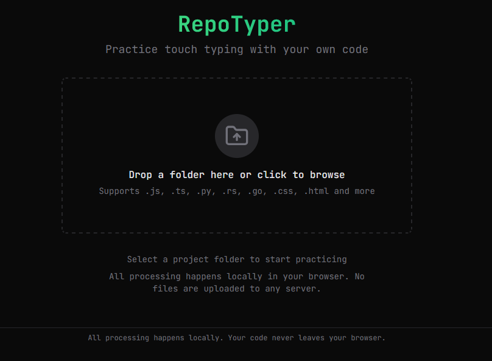
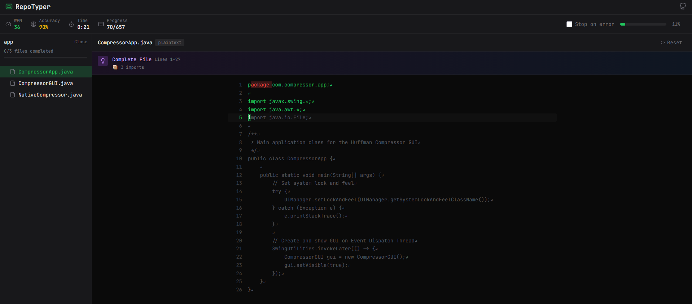

# RepoTyper

Minimal typing practice app for repo code chunks. Built with Next.js (App Router), Tailwind, Zustand, and Prism.

## Quick start
1. Install dependencies: `npm install`
2. Run dev server: `npm run dev`
3. Open http://localhost:3000

## Features
- Upload a folder of source files and practice typing code
- Comment-stripping and chunked typing for long files
- Code insight panel (imports/exports/functions/classes)
- Stats HUD with accuracy, WPM, and error count

